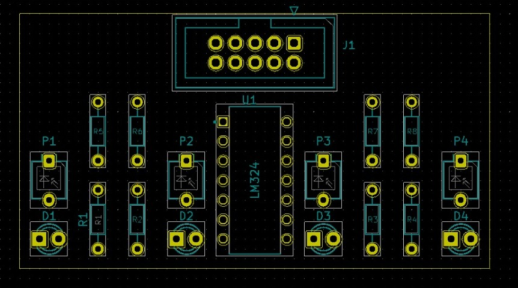
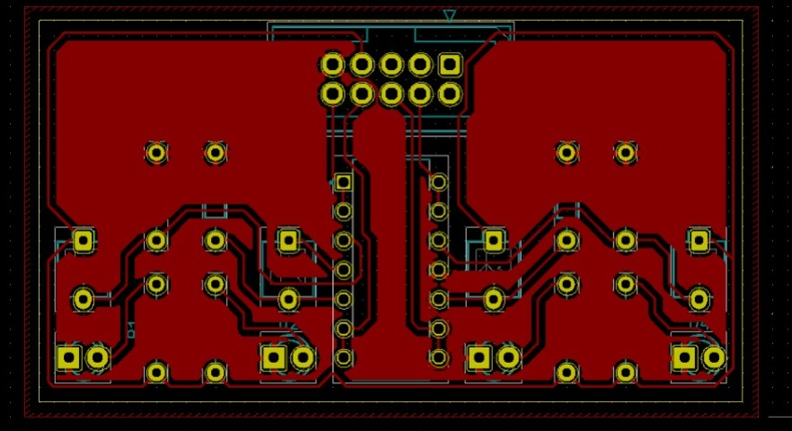

# pcb_design_lsa (Line Sensor Array)
## Using kiCAD - Open Source Software
This repository contains hardware design files and datasheets for the Line Sensor Array.
## Features
- 1 layered PCB design
- easy, cheap to manufacture
- separate provision for power and signal lines

## Uses
- Line Following
- Path Tracking

## Tools
To view/modify the files from this repository, install KiCAD from: [https://kicad.org](https://kicad.org)

## kicad_pcb

## layout

## 3D

